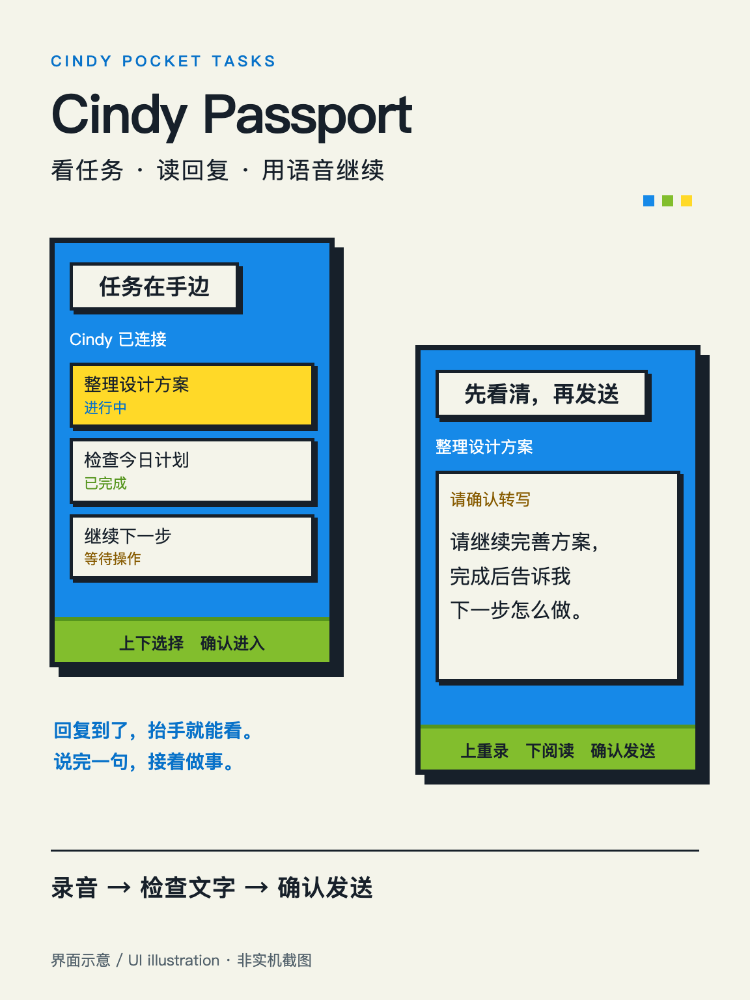

<p align="right"><strong>简体中文</strong> · <a href="README.md">English</a></p>

# Cindy Passport

把 [AI Passport](https://ai-passport.folotoy.cn) 变成 Cindy 的随身任务助手：查看任务状态、阅读回复、录音、检查转写文字，再确认发送到原任务。



## 什么是 AI Passport？

AI Passport 是 FoloToy 的开源随身设备，带有屏幕、按键、麦克风和扬声器，可以安装不同固件和社区玩法。本仓库是基于[官方开发模板](https://github.com/FoloToy/ai-passport) 整理的独立 Cindy 固件项目。

- [官方社区与玩法](https://ai-passport.folotoy.cn)
- [官方硬件与源码仓库](https://github.com/FoloToy/ai-passport)
- [Cindy](https://github.com/makecindy/cindy)
- [Cindy 配套 PR #4360](https://github.com/makecindy/cindy/pull/4360)：等待上游审核，正式版本包含此功能前请使用 PR 分支。
- [固件 v0.1.0](https://github.com/lengjingxu/cindy-passport/releases/tag/v0.1.0-cindy-passport)。社区项目 313、版本 516 已提交审核，当前待审核，尚未公开。

## 使用方式

1. 在 Mac 上运行配套 Cindy，在设置 → 快捷键 → 配件中启用 Cindy Passport。
2. 在 AI Passport 上进入 **Cindy BLE**，从 Cindy 选择设备；如系统要求，输入屏幕上的配对码。
3. 上下键选择任务，确认键进入。上下键翻页阅读 Cindy 的最新回复，确认键开始录音回复。
4. 再按确认停止录音。设备显示转写文字：上键重录，下键翻页，确认键发送到原任务。
5. 长按确认离开。未确认录音会丢弃，已提交的消息继续正常执行。

语音识别跟随 Cindy 当前配置的语音服务与识别模型，凭证留在 Mac。固件与配套客户端须一起更新；普通 Cindy 安装包不一定已包含此功能。

## 固件与构建

从 [Releases](https://github.com/lengjingxu/cindy-passport/releases) 下载经过校验的完整镜像。默认构建不含个人 Wi-Fi 凭证或设备身份数据。

目标为 ESP32-C3、8 MB Flash、无 PSRAM，使用 ESP-IDF 5.5.3；应用限额为 3 MB，`cardid` 保护分区固定在 `0x356000`。

```sh
# 先激活 ESP-IDF 5.5.3 环境。
./tools/validate.sh
```

完整检查会生成 `build/FoloToy-AI-Passport-full.bin`。已使用的设备请遵循[分段刷写说明](docs/development/engineering/protected-flash-layout.zh_CN.md)；直接写入完整镜像可能覆盖配对数据。更新 Cindy 时不要擦除整片 Flash 或覆盖 `cardid`。

更多信息见[交互与协议](docs/development/engineering/cindy-device.zh_CN.md)及[硬件指南](docs/hardware-design/AI_HARDWARE_DEVELOPMENT_GUIDE.zh_CN.md)。这是独立 Git 仓库，不属于 GitHub Fork 网络；保留了 FoloToy 原始许可证与来源说明。

## 许可证

固件基于 FoloToy AI Passport，遵循 [MIT](LICENSE)。内置 Noto 字体遵循单独的 [SIL Open Font License](assets/fonts/OFL.txt)。生成的界面示意图会明确标注，不冒充实机截图。
